Este artigo ([RNotebook](http://rmarkdown.rstudio.com/r_notebooks.html)) explora técnicas de *Análise de Redes Sociais* ([SNA](https://en.wikipedia.org/wiki/Social_network_analysis)) para analisar o comportamento e organização em redes colaboração de autores e desenvolvedores de pacotes de software para R[^1] publicados no repositório CRAN[^2].

## Introdução

### Redes Sociais

O trabalho em rede tem se tornado cada vez mais uma maneira de organização humana presente em nossas vidas e nos mais diferentes níveis da estrutura das empresas modernas. "_Os indivíduos, dotados de recursos e capacidades propositivas, organizam suas ações nos próprios espaços políticos em função de socializações e mobilizações suscitadas pelo próprio desenvolvimento das redes_". (MARTELETO 2001)

A dinâmica das redes funciona por meio de atividades relacionadas ao compartilhamento de valores e de idéias em comunidades, e em sua representação gráfica em que cada ator é representada por um nó, e as relações são representadas por linhas que conectam os nós. (STORCH 2008)

Analisar estas redes resume-se em estudar as ligações relacionais entre atores sociais. Estes atores, tanto podem ser pessoas e empresas individualmente ou coletivamente analisadas em unidades sociais, como por exemplo, departamento de uma organização, prestadoras de serviço público em um município ou estados-nação em um continente. (WASSERMAN 1994) 


### Vantagens Competitivas da Rede

O acesso à informação é um elemento-chave para o desenvolvimento econômico e social de comunidades, grupos sociais e indivíduos. A capacidade de obter informações, além dos contornos restritos da própria localidade, é parte do capital relacional dos indivíduos e grupos. (MARTELETO 2004)

O capital social, definido como o conjunto de vantagens obtida da rede de relacionamento, pode ser considerado como capital humano ou financeiro, investimentos para sua ampliação devem permitir retornos ou benefícios, servindo de base para o desenvolvimento. (BURT 2001)

Com efeito, a rede não é conseqüência, apenas, das relações que de fato existem entre os atores; ela é também o resultado da ausência de relações, da falta de laços diretos entre dois atores, do que BURT (1992) chama de "buracos estruturais". O "desenho" do tecido social apresenta-se, desse modo, como algo semelhante a um queijo suíço. Para os analistas que salientam o "fechamento da rede", o capital social guarda relação direta e proporcional com a quantidade de cliques (ou núcleos de tríades sobrepostas) e com a intensidade dos laços fortes (ENGLE 1999).


### Importancia da Análise de Redes Sociais

Análise das métricas de rede possibilitaria então apontar intervenções necessárias para otimizar as interações entre os atores das redes. 

Análise de Redes Sociais possibilitam, dentre outros, os seguintes benefícios para as organizações: promoção da integração da rede de pessoas participantes em atividades de negociações da empresa, identificação dos indivíduos que não compartilham seus conhecimentos; a avaliação do desempenho de um grupo de pessoas que trabalham de forma integrada, dentre outros. 

Muitas práticas gerenciais habituais no cotidiano das empresas e corporações podem explorar os conceitos e mecanismos da organização em rede, melhorando a sua efetividade: 

* **Gestão de Talentos**: Encontrar os líderes naturais na organização;
* **Inovação**: Identificar fronteiras. Garantir que a organização tenha acesso a novas idéias;
* **Colaboração**: Encontrar lacunas no conhecimento dentro de grupos, ou entre organizações ou geografias. Monitorar ou medir mudanças;
* **Gestão do conhecimento**: Identificar e manter conhecimentos vitais. Monitorar ou medir mudanças no conhecimento ou na troca de conhecimento;
* **Mudança Organizacional e Desenvolvimento**: Encontrar líderes de opinião para iniciativas de gerenciamento de mudanças ou durante a integração após fusões e aquisições;
* **Desempenho Organizacional**: Diagnosticar a coesão entre os membros da equipe e identificar conexões críticas para a melhoria.


## Conceitos Chaves para Análise de Redes

O uso primário da teoria de grafos na análise de rede é buscar identificar "importante" atores. O conceito de prestígio e centralidade busca quantificar ideias teóricas sobre a proeminência de um ator em uma rede, sumarizando as relações estruturais com os demais atores. Além disso, fornece indicadores no nível de grupo, que permite avaliar a dispersão ou desigualdade (de recursos e/ou informações) entre todos os atores da rede.

A *teoria de grafos*, campo da da matemática que estuda as relações entre os objetos de um determinado conjunto, fornece os mecanismos matemáticos que são base para a análise das estruturas da rede. Através do entendimento da estrutura de uma rede é possível ter _insights_ sobre seus padrões, propriedades e indivíduos. 

Um grafo é uma representação matemática de uma rede social, onde os elementos (empresas, pessoas, etc.) são representados por vértices e a relação entre os elementos são representados como arestas entre dois vértices. A ligação (aresta) pode ser direcional ou não direcional. Pode-se associar valores tanto aos nós como arestas.


```r
# Lista de arestas, os números são identificadores dos nós
g_edgelist <- data.frame(
  from = c( 1,1,2,2,3,3,5,5),
  to   = c( 2,3,3,5,4,5,6,7)
) 

# construindo a rede a partir da lista de arestas
g <- g_edgelist %>%
  as.matrix() %>%
  graph.edgelist(directed = FALSE) %>% # usando igraph 
  as_tbl_graph() %>%
  activate("nodes") %>%
  mutate( name = LETTERS[1:7] ) # nomeando os nós

# calculando previamente as métricas
g <- g %>% 
  mutate( degree = centrality_degree(), 
          btwn   = round( centrality_betweenness(),2 ),
          clsn   = round( centrality_closeness(normalized = T),2 ),
          eign   = round( centrality_eigen(scale = F), 2 ))

# fixando o layout previamente para todos os plots terem a mesma disposicao
g_layout <- create_layout(g, layout = "kk")

# plotando o graph
ggraph(g_layout) +
  geom_edge_fan(alpha=0.3) +
  geom_node_point(color="blue",alpha=0.8, size=8) +
  geom_node_text(aes(label=name), color="white") +
  theme_void() +
  ggtitle( "Exemplo de Rede" ) + 
  theme( legend.position = "none" )
```

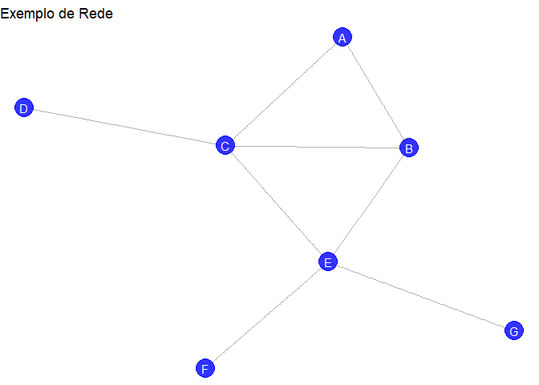<!-- -->


Há uma série de métricas e propriedades (Newmann, 2010) de um grafo que podem fornecer informações relevantes sobre a relação (arestas) entre os indivíduos (vértices) e os próprios indivíduos quando esse representa uma rede social. Iremos explorar algumas propriedades que podem estar ligadas a identificação de capital social, são elas:

* Degree Centrality
* Betweenness Centrality
* Closeness Centrality
* Eigenvector Centrality
* Components
* Density
* Diameter
* Eccentricy


#### Degree Centrality (Grau)

O Grau (_Degree_) é o número de arestas (ou links) que levam para dentro ou para fora de um vértice. Freqüentemente usado como medida de conexão de um nó para outros nós imediatos. Podendo assim representar influencia e/ou popularidade de um nó juntos aos demais. Útil na avaliação de quais nós são fundamentais em relação à disseminação de informações e na capacidade influenciar outros nós na localidade imediata.

Exemplos:

* Quantas pessoas essa pessoa pode alcançar diretamente?
* Em uma rede de músicos: com quantas pessoas essa pessoa já colaborou/tocou junto?


```r
# plot da rede evidenciando o degree
ggraph(g_layout) +
  geom_edge_fan(alpha=0.4) +
  geom_node_point(aes(color = degree), size=8) + 
  geom_node_text(aes(label=name),color="white") +
  geom_node_text(aes(label=degree, color=degree), nudge_y = NUDGE_Y ) +
  theme_graph() +
  # ggtitle( "Degree" ) + 
  theme( legend.position = "none" )
```

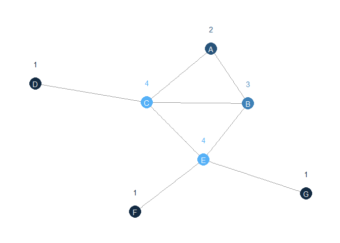<!-- -->


#### Betweenness Centrality (Intermediação)

A *Betweenness Centrality* é uma métrica que representa quantos caminhos curtos (_shortest path_) que ligam outros nó da rede, passam pelo nó em questão. Para calcular o valor para um determinado nó **v**, calcule o número de caminhos mais curtos entre os nós **i** e **j** que passam através de **v** e divida por todos os caminhos mais curtos entre **i** e **j**. Repita para todo os nós.

É uma medida importante, pois representa "o quanto" um nó, ou vértice, está dentro dos fluxos de informações possíveis entre os outros nós. Quanto mais alto o valor, maior a importância do nó, como um elo de comunicação entre os demais nós.

Esta métrica também pode ser calculada com respeito a uma aresta, assim estaríamos medindo o quanto um link entre dos nós participa dos caminhos mais curtos entre os nós da rede.

Exemplos:

* Qual a probabilidade de esta pessoa ser a rota mais direta entre duas pessoas na rede?
* Me uma rede de espiões: quem é o espião pela qual a maioria das informações confidenciais pode fluir?


```r
# plot da rede evidenciando o betweenness
ggraph(g_layout) +
  geom_edge_fan(alpha=0.4) +
  geom_node_point(aes(color = btwn), size=8) + 
  geom_node_text(aes(label=name),color="white") +
  geom_node_text(aes(label=btwn, color=btwn), nudge_y = NUDGE_Y ) +
  theme_graph() +
  # ggtitle( "Betweenness Centrality" ) + 
  theme( legend.position = "none" )
```

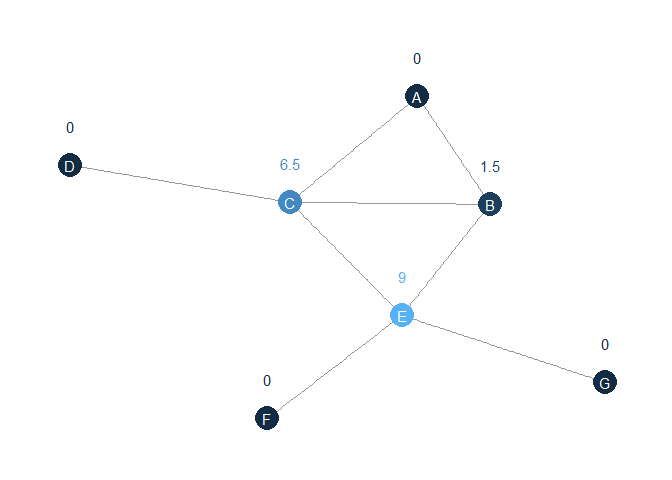<!-- -->


#### Closeness Centrality (Proximidade)

Representa o quão perto um nó está dos demais, pode ser uma medida direta da contagem de arestas ou da soma dos pesos dela. Para obtê-la calcule o comprimento médio de todos os caminhos mais curtos de um nó para todos os outros nós da rede.

É uma medida de _alcance_, mediria por exemplo a velocidade com informações pode alcançar outros nós a partir de um determinado nó inicial, quanto mais próximo um nó dos demais, mais rápido este nó influenciaria outros.

Exemplos:

* Quão rápido essa pessoa pode alcançar todos na rede?
* Em rede de relações sexuais: quão rápido uma DST se espalhará dessa pessoa para o resto da rede?


```r
ggraph(g_layout) +
  geom_edge_fan(alpha=0.4) +
  geom_node_point(aes(color = clsn), size=8) + 
  geom_node_text(aes(label=name),color="white") +
  geom_node_text(aes(label=clsn, color=clsn), nudge_y = NUDGE_Y ) +
  theme_graph() +
  # ggtitle( "Closeness" ) + 
  theme( legend.position = "none" )
```

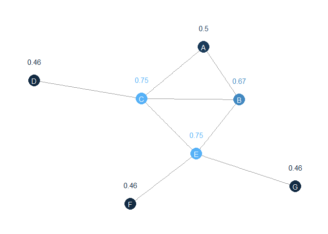<!-- -->


#### Eigenvector Centrality (Autovetor)

A centralidade do _autovetores_ de um nó é proporcional à soma das centralidades de _autovetores de todos os nós diretamente conectados a ele. A métrica é obtida através da fatoração e calculo de autovetores da _matriz de adjacência_[^3] que representa a rede.

Está associado a reputação e um vértice com respeito às suas ligações.

Exemplos:

* Quão bem esta pessoa está conectada a outras pessoas bem conectadas?
* Na rede de citações de artigos: quem é o autor mais citado por outros autores bem citados?


```r
ggraph(g_layout) +
  geom_edge_fan(alpha=0.4) +
  geom_node_point(aes(color = eign), size=8) + 
  geom_node_text(aes(label=name),color="white") +
  geom_node_text(aes(label=eign, color=eign), nudge_y = NUDGE_Y ) +
  theme_graph() +
  # ggtitle( "Eigenvector" ) + 
  theme( legend.position = "none" )
```

<!-- -->


#### Componentes

Um rede pode ter ser segmentada, ou seja, nós formam sub-redes não conectadas entre si, tais sub-redes são chamadas de componentes.


```r
# montando uma lista de arestas (os números identificam o vértice)
edgelist <- data.frame(
  from = c(1,1,2,4,2,3,4,5,6,6,7,7,8,8,9,10),
  to   = c(2,3,4,3,5,4,5,1,7,8,9,8,9,10,10,7)
)

# construindo o grafo a partid da lista de aresta
edgelist %>%
  as.matrix() %>%
  graph.edgelist(directed = T) %>%
  as_tbl_graph() %>%
  activate("nodes") %>%
  mutate( name = LETTERS[1:10],
          component = as.factor(group_components())) -> g


ggraph(g, layout="kk") +
  geom_edge_fan(alpha=0.2, arrow = arrow(type="closed", angle=10, length = unit(5,units = "mm") ))+
  geom_node_point(aes(color=component),alpha=0.8, size=8) +
  geom_node_text(aes(label=name), color="white") +
  theme_void() +
  ggtitle( "Components" ) + 
  theme( legend.position = "none" )
```

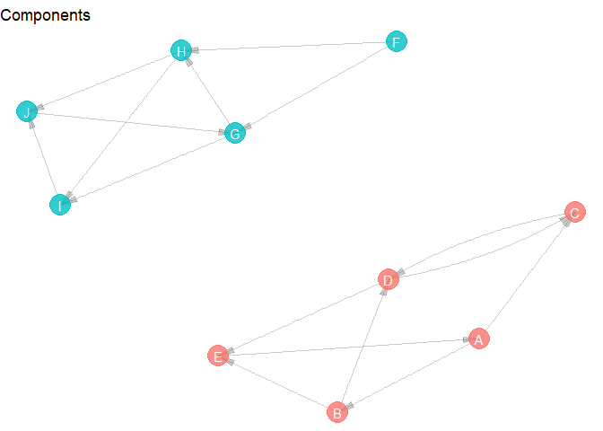<!-- -->


### Identificando Atores e Padrões

Usando as métricas listadas acima é possível identificar e classificar a atuação e importância dos atores em uma rede.

Tome-se como exemplo esta rede:


```r
# lista de ligacoes
h_edgelist <- data.frame(
  from = c( 0,  1, 1,  2, 2, 3, 3,  3,  4, 5, 5, 5, 8),
  to   = c(10, 10, 2, 10, 3, 4, 5, 10, 10, 6, 7, 8, 9)
) + 1

# construcao da rede
h <- h_edgelist %>%
  as.matrix() %>%
  graph.edgelist(directed = FALSE) %>%
  as_tbl_graph() %>%
  activate("nodes") %>%
  mutate( name = LETTERS[1:11] ) # nomeando nos

# plot
ggraph(h, layout="kk") +
  geom_edge_fan(alpha=0.2) +
  geom_node_point(color="red",alpha=0.9, size=8) +
  geom_node_text(aes(label=name), color="white") +
  theme_void() +
  ggtitle( "Exemplo" ) + 
  theme( legend.position = "none" )
```

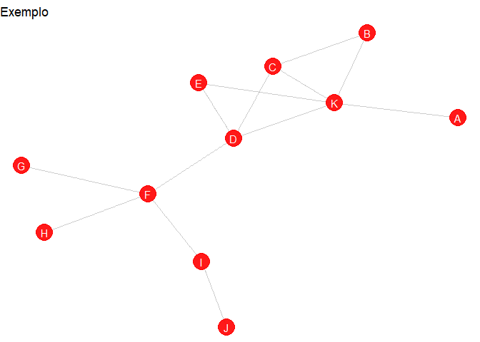<!-- -->

Vamos combinar as medidas de centralidade para exibir importantes atores na estrutura.


```r
# calculando métricas de centralidade 
h <- h %>%
  activate("nodes") %>%
  mutate (
    degree = as.factor(centrality_degree()),
    btwn = round(centrality_betweenness(), 2),
    clsn = round(centrality_closeness(normalized = T), 2),
    eign = round(centrality_eigen(scale = T), 2),
    clst = as.factor(group_edge_betweenness())) %>% 
  
  # centrality das arestas
  activate("edges") %>%
  mutate( ebtwn = centrality_edge_betweenness() )

ggraph(h, layout="kk") +
  geom_edge_fan2(alpha=0.4, aes(edge_colour = ebtwn, label=ebtwn), label_size=3) +
  geom_node_point(aes(color=degree, size=clsn),alpha=0.5) +
  geom_node_text(aes(label=name), color="black") +
  geom_node_text(aes(label=eign, color=degree), nudge_y = -NUDGE_Y/2, size=2) +
  theme_void() +
  ggtitle( "Combinando Métricas" ) + 
  scale_color_manual(breaks = c("1", "2","3", "5", "10"),
                     values=c("red","red","lightskyblue","lightskyblue","darkblue"))
```

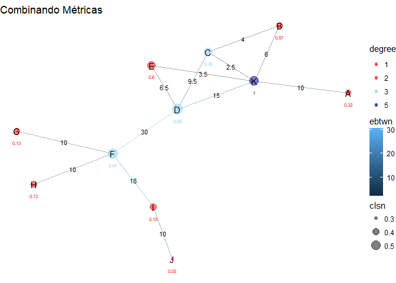<!-- -->

As várias medidas de centralidade são mostradas acima e são representadas:

* Cor do vértice: Degree Centrality
* Tamanho do vértice: Closeness Centrality
* Número abaixo do vértice: Eigenvetor Centrality
* Cor e valor na aresta: Edge Betweenness Centrality


```r
h %>% activate("nodes") %>%
  as.tibble() %>%
  select(-clst) %>%
  knitr::kable(caption="Métricas de Centralidade dos Nós")
```


Table: Métricas de Centralidade dos Nós

name   degree    btwn   clsn   eign
-----  -------  -----  -----  -----
A      1          0.0   0.34   0.32
B      2          0.0   0.36   0.57
C      3          3.0   0.45   0.78
D      4         25.5   0.59   0.89
E      2          0.0   0.43   0.60
F      4         29.0   0.56   0.41
G      1          0.0   0.37   0.13
H      1          0.0   0.37   0.13
I      2          9.0   0.40   0.15
J      1          0.0   0.29   0.05
K      5         13.5   0.50   1.00


Através das relações entre as centralidades é possível identificar os seguintes aspectos

* Nós mais conectados: **K** com mais conexões seguidas de **D** e **F**;
* A ligação entre a **F** e **D** é a de maior *intermediação*, além disso se removida desconecta o gráfico;
* O nó **D** é o mais próximo aos demais e
* O nó **K** é no mais referenciado por nós mais referenciados (maior *eigenvector*), seguido logo por **D**, mais uma vez mostrando a importância do no **D** na estrutura da rede.


#### Gatekeepers & Accessors

Combinando duas métricas de centralidade, autovetores e intermediação, é possível evidenciar dois tipos de atores específicos numa rede. 

* Um ator com **alta intermediação** (*betweenness*) e **baixo autovetor** (*eigenvector*) pode ser um porteiro (_Gatekeeper_) importante para um ator central ou atores importantes.
* Um ator com **baixa intermediação** e **alto autovetor** pode ter acesso exclusivo a atores centrais.


```r
h %>% activate("nodes") %>% as_tibble() %>% 
  ggplot(aes(x=btwn, y=eign)) + 
  geom_point() + geom_label(aes(label=name)) +
  theme( legend.position = "none" )
```

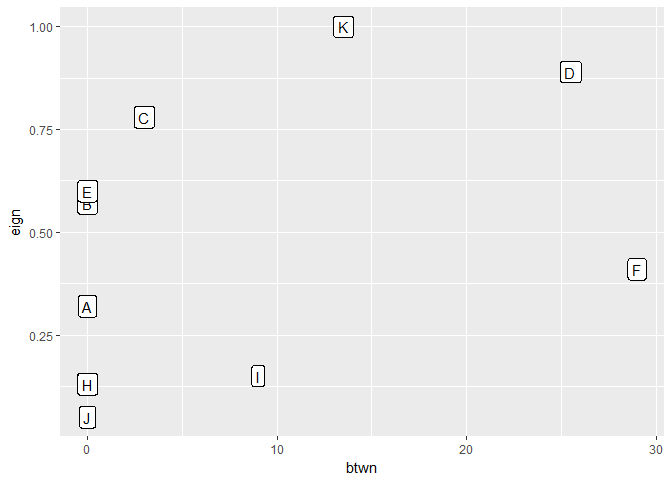<!-- -->


Observando a distribuição de como *eigenvector* fica em função *betweenness*, é possível observar então que o nó **F** atua como um *Gatekeeper* e o nó **C** como um nó de acesso a atores importantes (*accessor*).


```r
# key actors type
h <- h %>%
  activate("nodes") %>%
  mutate( type = as.factor(case_when(
    name == "F" ~ "gatekeeper",
    name == "C" ~ "access to central actors",
    TRUE ~ "others"
  )))

# plot
ggraph(h, layout="kk") +
  geom_edge_fan2(alpha=0.4, aes(edge_colour = ebtwn), label_size=3) +
  geom_node_point(aes(color=type),alpha=0.9, size=8) +
  geom_node_text(aes(label=name), color="white") +
  geom_node_text(aes(label=eign), nudge_y = NUDGE_Y, size=3) +
  theme_void() +
  # ggtitle( "Gatekeeper and Accessor" ) + 
  scale_color_manual(breaks = c("others","gatekeeper","access to central actors"),
                     values=c("red","lightskyblue","darkblue"))
```

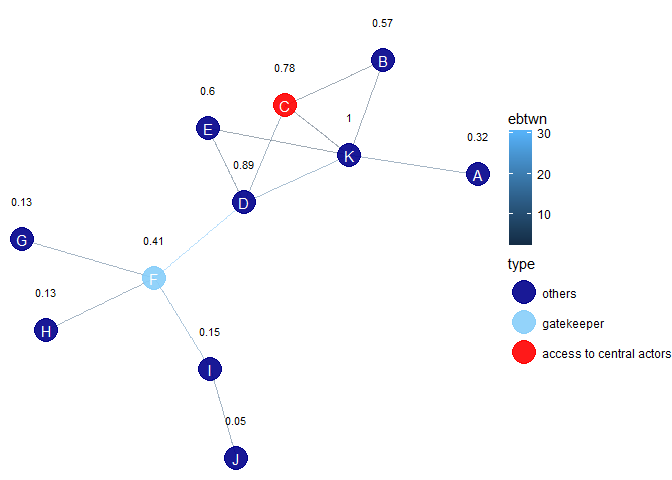<!-- -->


Podemos perceber que o nó **C** é o nó que "dá acesso" a nós de alta reputação (*eigenvector*) enquanto o nó **F**, é um nó de relativa baixa reputação que atua de porteiro para os nós de atua relevância (D, K, E e C).


#### Comunidades (_clusters_)

Muitas redes consistem em módulos que estão densamente conectados, mas que estão escassamente conectados a outros módulos, a esses módulos é dado o nome de *comunidade*. A ideia da detecção de estrutura de comunidade é descobrir "bordas" e detectar arestas quem ligam módulos separados. 

Uma estratégia é calcular a centralidade de betweenness das arestas e ir removendo gradualmente as arestas de maior pontuação, desconectando o gráfico, identificando assim as comunidades.


```r
ggraph(h, layout="kk") +
   geom_edge_fan2(alpha=0.5, aes(edge_colour = ebtwn)) +
  geom_node_point(aes(color=clst),alpha=0.9, size=8) +
  geom_node_text(aes(label=name), color="white") +
  # ggtitle( "Community / Clusters" ) + 
  theme_void() + 
  theme( legend.position = "none" )
```

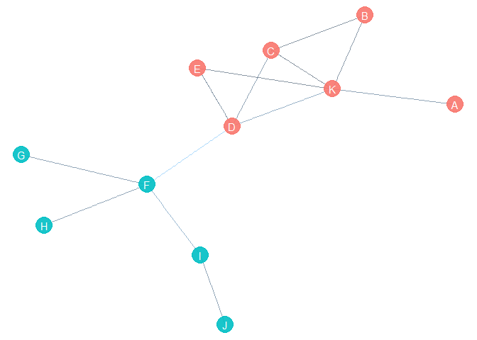<!-- -->


## Rede de Colaboração de Autores no CRAN

CRAN[^2] é o repositório oficial de pacotes de R, [listando](https://cran.r-project.org/web/packages/available_packages_by_name.html) todos os pacotes produzido e disponibilizado gratuitamente pela comunidade de usuário e programadores. Os pacotes fornece funcionalidades adicionais ou específicas para o R e para serem utilizados devem ser copiados, instalados e carregados. 

Qualquer pessoa pode desenvolver e disponibilizar pacotes, porém é mais comum que os pacotes sejam desenvolvidos por equipes de pesquisa e grupos de programadores dentro de empresas ou universidades ou que sejam um desenvolvimento que segue a dinâmica de software _open source_, quando o código do pacote está público e recebe contribuição de vários desenvolvedores espalhados pelo mundo.

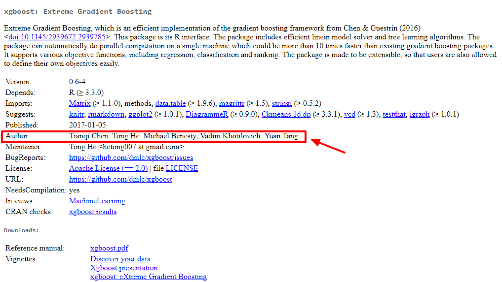

O pacote publicado contém uma lista de autores, que contribuíram para construir e publicar o pacote. O objetivo desta análise entender como se organiza a rede de colaboração de autores, para isso usaremos os dados de publicação para construir uma rede, onde cada vértice da rede é um ator e uma aresta identifica um pacote em que dois (ou mais autores) colaboraram juntos.


### Construindo a Rede


```r
# dados de publicacao de pacotes
pdb <- tools::CRAN_package_db()

# campo de autores dos pacotes
pbaut <- pdb$Author 

# campo de autores dos pacotes
aut <- pdb$Author %>%
  iconv(to = "ASCII//TRANSLIT") %>%
  map(function(x) format(as.person(x),include = c("given", "family" ))) %>%
  set_names(pdb$Package)%>%
  map(function(v) keep(v,~.x!="")) %>%
  magrittr::extract(map_lgl(., function(x) length(x) > 1))

# conta autores por pacote
aut_list <- aut %>%
  unlist() %>%
  dplyr::as_data_frame() %>%
  count(value) %>%
  rename(name = value, packages = n) %>%
  filter( name!="" | is.na(name) )

# transforma a lista "pacote" -> [autores] em uma edge list
edge_list <- aut %>%
  map(combn, m = 2) %>%    # em cada pacote (map) gera uma combinacao do array de autores dois a dois
  do.call("cbind", .) %>%  
  t() %>%
  dplyr::as_data_frame() %>%
  arrange(V1, V2) %>%
  count(V1, V2) 

# controi a rede a partir da lista de arestas
authors_network <- edge_list %>%
  select(V1, V2) %>%
  as.matrix() %>%
  graph.edgelist(directed = FALSE) %>%
  as_tbl_graph() %>%    # wrapper tidygraph para o objeto igraph
  activate("edges") %>% 
  mutate(weight = edge_list$n) %>% # resgata o peso das arestas (# de pacotes)
  activate("nodes") %>%
  left_join(aut_list, by="name") # nomeia os nós com os nomes dos autores

# dados de autores e arestas
total_authors <- authors_network %>% activate("nodes") %>% as.tibble() %>% nrow()
total_edges <- authors_network %>% activate("edges") %>% as.tibble() %>% nrow()
```


### Selecionando Components

A rede construída é composta de 14425 autores que se relacionam através 55944 arestas. Dado a natureza do objeto estudado espera-se que essa rede não seja conecta integralmente, formando então **componentes** de colaboração entre grupos de autores distintos, vamos analisar esse aspecto.


```r
# identifica os components
set.seed(1975)
g <- authors_network %>% 
  activate("nodes") %>%  
  mutate(component = as.factor(group_components()))

# tabela components por número de autores
authors.by.components <- g %>% 
  activate("nodes") %>%
  as.tibble() %>%
  group_by(component) %>%
  summarise( authors=n() ) %>%
  arrange( desc(authors) )

# top 10 maiores components
knitr::kable(head(authors.by.components,10), caption = "Maiores componentes (top 10)")
```


Table: Maiores componentes (top 10)

component    authors
----------  --------
3               6784
35                68
38                51
428               29
6                 28
265               28
750               25
34                23
50                23
51                23


```r
# selecionando os componentes para comparacao
sel_components <- c(35,38,265)
```


Vamos selecionar três destes componentes para caracterizá-los: 35, 38, 265 [^4].

### Comparando os três components


```r
# plotando os components
g %>%
  filter( component %in% sel_components ) %>%
  ggraph(layout="auto") +
  geom_edge_fan(alpha=0.2)+
  geom_node_point(aes(color=component),alpha=0.8, size=2) +
  theme_void()
```

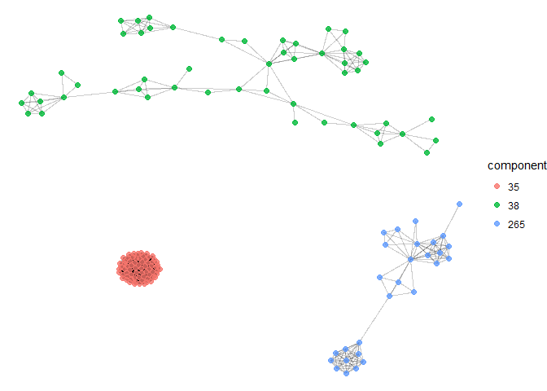<!-- -->


Nota-se que os componentes possuem estruturas distintas umas das outras, vamos caracterizá-las com métricas de rede.


```r
# para cada um do componentes escolhidos
net_metrics <- rbindlist(lapply( sel_components, function(comp){
  # filtra pelo component
  h <- g %>% filter( component == comp )
  # calcula metricas de rede
  res <- data.frame(
    component = comp,
    nodes     = h %>% activate("nodes") %>% as.tibble() %>% nrow(),
    density   = round(graph.density(h, loops = F),4),
    diameter  = diameter(h, directed = F, unconnected = F, weights = NULL),
    eccentricity = max(eccentricity(h, mode="all"))/min(eccentricity(h, mode="all"))
  )
  return(res)
}))

# tabela
knitr::kable(net_metrics)
```


 component   nodes   density   diameter   eccentricity
----------  ------  --------  ---------  -------------
        35      68    1.0000          1       1.000000
        38      51    0.0949         10       1.800000
       265      28    0.2751          6       1.666667


Para cada um dos componentes calculamos:

* **densidade**: número de arestas da rede dividido pelo número de arestas possíveis;
* **diâmetro**: maior menor caminho (_shortest path_) existente na rede e
* **excentricidade**: aqui definida como o diâmetro dividido pelo menor caminho (_shortest path_).

Nota-se nos valores que as redes de fato são distintas nessas dimensões.

### analise de atores 


```r
# calcula centralidades para uma rede
calcNodeMetrics <- function(net, comp){
  net %>%
    activate("nodes") %>%
    filter( component==comp ) %>%
    mutate(
      degree = centrality_degree(),
      btwn = round(centrality_betweenness(), 2),
      clsn = round(centrality_closeness(normalized = T), 2),
      eign = round(centrality_eigen(scale = T), 2),
      clst = as.factor(group_edge_betweenness())
    ) %>%
    activate("edges") %>%
    mutate( ebtwn = centrality_edge_betweenness() ) %>%
    return()
}

# para cada um dos componentes, faz o calculo de centralidades
netMetrics <- lapply(sel_components, function(comp) calcNodeMetrics(g,comp) )
netMetrics <- setNames(netMetrics, sel_components)
```


#### Component 35


```r
ggraph(netMetrics[1][[1]], layout="kk") +
  geom_edge_fan2(alpha=0.2, aes(edge_colour = ebtwn)) +
  geom_node_point(aes(color=btwn, size=degree),alpha=0.9) +
  theme_void() %>% +
  theme( legend.position = "none" ) + 
  ggtitle( paste0("Componente ",names(netMetrics[1]) ) )
```

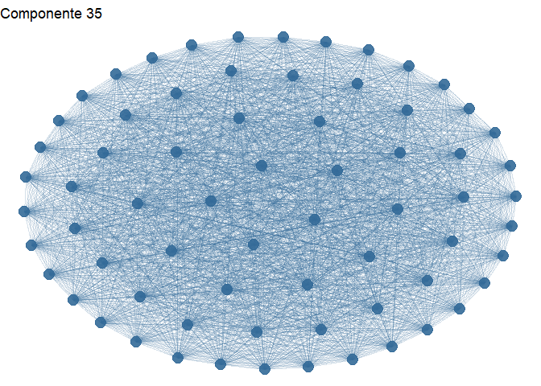<!-- -->


Numa rede totalmente conectada (densidade = 1), todos os nós e arestas tem as mesmas métricas, não é possível selecionar um (ou mais autores) como mais influente ou relação mais importante, a rede é homogênea. Este componente é composto de autores de um só pacote ([rcorpora](https://cran.r-project.org/web/packages/rcorpora/index.html)), cujo os autores não trabalharam com nenhum outro conjunto de autores.


#### Componente 38


```r
  ggraph(netMetrics[2][[1]], layout="kk") +
    geom_edge_fan2(alpha=0.4, aes(edge_colour = ebtwn)) +
    geom_node_point(aes(color=btwn, size=btwn),alpha=0.9) +
    theme_void() + 
    theme( legend.position = "none" ) + 
    ggtitle( paste0("Componente ", names(netMetrics[2])) )
```

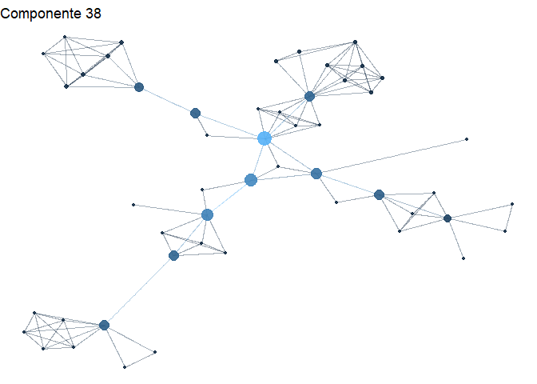<!-- -->


```r
netMetrics[2][[1]] %>%
  activate("nodes") %>%
  as.tibble() %>%
  arrange( desc(btwn), desc(degree), desc(eign), desc(clsn) ) %>%
  select(-component, -clst) %>%
  head(10) %>%
  knitr::kable(caption = "Autores por Betweeness (10 mais)")
```


Table: Autores por Betweeness (10 mais)

name                 packages   degree    btwn   clsn   eign
------------------  ---------  -------  ------  -----  -----
Min Zhang                   3       10   733.0   0.34   0.02
Bhramar Mukherjee           2        5   525.0   0.33   0.00
Victor Moreno               3        7   493.0   0.29   0.00
Seunggeun Lee               4        6   409.0   0.32   0.00
Michal Juraska              3       13   341.0   0.29   0.01
Juan R Gonzalez             3        5   336.0   0.24   0.00
Isaac Subirana              4        8   311.0   0.18   0.00
Michael Wu                  2        6   301.0   0.26   0.00
Dabao Zhang                 2        3   301.0   0.28   0.07
Chen Chen                   2        5   265.5   0.23   0.53


A rede do componente 6 já é bem menos acoplada, portanto de menor densidade, é possível visualizar os autores mais bem "relacionados" e os autores que atuam com "pontes" entre os diversos nós na estrutura. Isso é reflexo de quando o autor trabalha em momentos diferentes com outros grupos de autores em pacotes diferentes.


```r
ggraph(netMetrics[2][[1]], layout="kk") +
  geom_edge_fan2(alpha=0.4, aes(edge_colour = ebtwn)) +
  geom_node_point(aes(color=eign, size=eign),alpha=0.9) +
  theme_void() + 
  theme( legend.position = "none" ) + 
  ggtitle( paste0("Componente ",names(netMetrics[2])," - Eigenvector Centrality") )
```

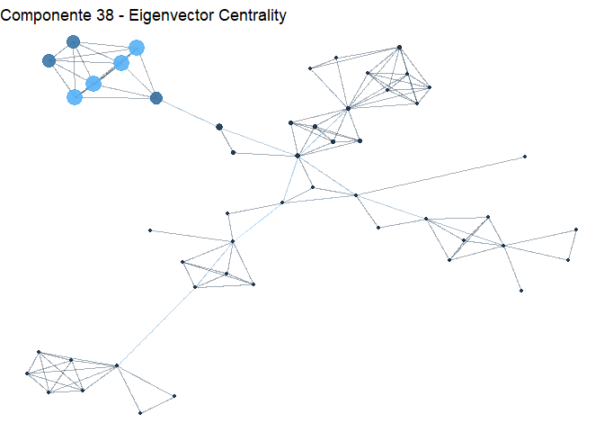<!-- -->


```r
netMetrics[2][[1]] %>%
  activate("nodes") %>%
  as.tibble() %>%
  arrange( desc(eign), desc(degree), desc(btwn), desc(clsn) ) %>%
  select(-packages, -component, -clst) %>%
  head(10) %>%
  knitr::kable( caption="Autores por Eigenvector (10 mais)")
```


Table: Autores por Eigenvector (10 mais)

name               degree    btwn   clsn   eign
----------------  -------  ------  -----  -----
Brenda McCowan          6    22.5   0.19   1.00
Brianne Beisner         6    22.5   0.19   1.00
Hsieh Fushing           6    22.5   0.19   1.00
Jian Jin                6    22.5   0.19   1.00
Aaron Shev              5     1.5   0.16   0.60
Kevin Fujii             5     1.5   0.16   0.60
Chen Chen               5   265.5   0.23   0.53
Dabao Zhang             3   301.0   0.28   0.07
Min Zhang              10   733.0   0.34   0.02
Michal Juraska         13   341.0   0.29   0.01


#### Componente 265

O componente 265 tem uma estrutura mais acoplada, com uma densidade de 0.2751, intermediária entre a 35 e 38, é possível observar grupos que trabalham juntos e grande autor central conectando os subgrupos.


```r
  ggraph(netMetrics[3][[1]], layout="kk") +
    geom_edge_fan2(alpha=0.4, aes(edge_colour = ebtwn)) +
    geom_node_point(aes(color=btwn, size=btwn),alpha=0.9) +
    theme_void() + 
    theme( legend.position = "none" ) + 
    ggtitle( paste0("Componente ",names(netMetrics[3])," - Betweenness") )
```

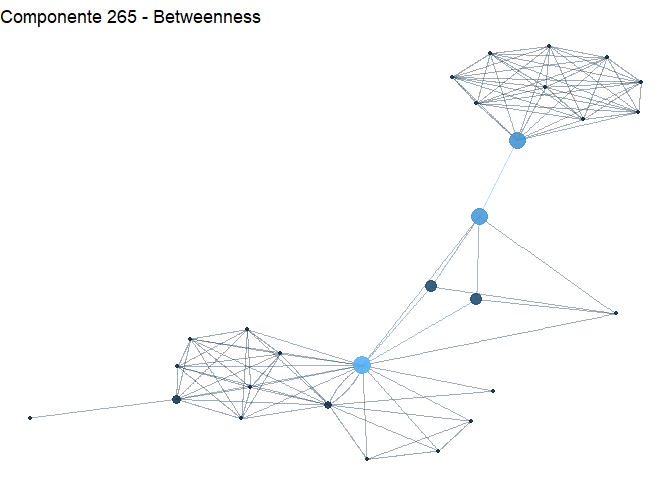<!-- -->


```r
netMetrics[3][[1]] %>%
  activate("nodes") %>%
  as.tibble() %>%
  arrange( desc(btwn), desc(degree), desc(eign), desc(clsn) ) %>%
  select(-component, -clst) %>%
  head(10) %>%
  knitr::kable(caption = "Autores por Betweeness (10 mais)")
```


Table: Autores por Betweeness (10 mais)

name                packages   degree     btwn   clsn   eign
-----------------  ---------  -------  -------  -----  -----
Kim-Anh Le Cao             5       17   199.83   0.46   1.00
Emma Huang                 3        5   170.33   0.42   0.34
Andrew George              2       10   162.00   0.37   0.16
Anne Bernard               1        3    59.67   0.44   0.18
Dominique Gorse            1        3    59.67   0.44   0.18
Ignacio Gonzalez           2        9    26.00   0.36   0.58
Florian Rohart             3       13    17.50   0.37   0.86
Jasmin Straube             2        4     0.33   0.32   0.33
Andrew Kirby               1        9     0.00   0.30   0.13
Claire Wade                1        9     0.00   0.30   0.13


```r
ggraph(netMetrics[3][[1]], layout="kk") +
  geom_edge_fan2(alpha=0.4, aes(edge_colour = ebtwn)) +
  geom_node_point(aes(color=eign, size=eign),alpha=0.9) +
  theme_void() + 
  theme( legend.position = "none" ) + 
  ggtitle( paste0("Componente ",names(netMetrics[3])," - Eigenvector Centrality") )
```

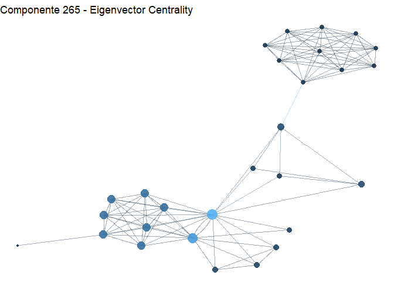<!-- -->


```r
netMetrics[3][[1]] %>%
  activate("nodes") %>%
  as.tibble() %>%
  arrange( desc(eign), desc(degree), desc(btwn), desc(clsn) ) %>%
  select(-packages, -component, -clst) %>%
  head(10) %>%
  knitr::kable( caption="Autores por Eigenvector (10 mais)")
```


Table: Autores por Eigenvector (10 mais)

name                                                     degree     btwn   clsn   eign
------------------------------------------------------  -------  -------  -----  -----
Kim-Anh Le Cao                                               17   199.83   0.46   1.00
Florian Rohart                                               13    17.50   0.37   0.86
Ignacio Gonzalez                                              9    26.00   0.36   0.58
contributions from Pierre Monget                              8     0.00   0.35   0.57
Benoit Liquet.                                                8     0.00   0.35   0.57
FangZou Yao                                                   8     0.00   0.35   0.57
Jeff Coquery                                                  8     0.00   0.35   0.57
Francois Bartolo                                              8     0.00   0.35   0.57
Sebastien Dejean with key contributors Benoit Gautier         8     0.00   0.35   0.57
Emma Huang                                                    5   170.33   0.42   0.34


### Analisando colaboração recorrente

Vamos analisar frequência de publicação por autores, excluindo autores que contribuíram apenas uma vez.


```r
aut_list %>% 
  select(packages) %>%
  unlist() %>%
  summary()
```

```
##    Min. 1st Qu.  Median    Mean 3rd Qu.    Max. 
##   1.000   1.000   1.000   1.553   1.000 108.000
```

Observa-se que mais de 75% (3rd Quarter) dos autores contribuíram apenas 1 vez com outros autores, para estabelecer uma rede de colaboração mais efetiva (e não apenas momentânea), vamos filtrar na rede autores que  pelo menos 5 pacotes.


```r
# obtendo a rede de colaboradores com mais de 5 publicações
h <- authors_network %>%
  activate("nodes") %>%
  filter( packages > 5 ) %>%
  mutate( component = group_components() ) %>%
  # escolhendo o maior component
  filter( component == names(table(component))[which.max(table(component))] ) 

# dados de autores e arestas
total_authors <- h  %>% activate("nodes") %>% as.tibble() %>% nrow()
total_edges <- h  %>% activate("edges") %>% as.tibble() %>% nrow()

ggraph(h, layout="lgl") +
  geom_edge_fan(alpha=0.1)+
  geom_node_point(alpha=0.2, size=0.2) +
  theme_void()
```

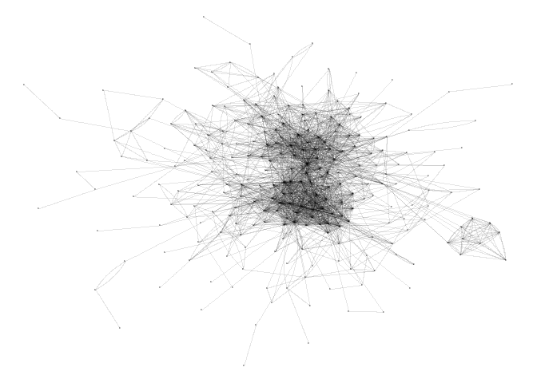<!-- -->

Temos então o maior componente da rede de colaboração de autores que publicaram mais de 5 pacotes com as características:


```r
knitr::kable( data.frame(
    nodes     = h %>% activate("nodes") %>% as.tibble() %>% nrow(),
    edges     = h %>% activate("edges") %>% as.tibble() %>% nrow(),
    density   = round(graph.density(h, loops = F),4),
    diameter  = diameter(h, directed = F, unconnected = F, weights = NULL),
    eccentricity = max(eccentricity(h, mode="all"))/min(eccentricity(h, mode="all"))
), caption = "Dados do Componente de Autores")
```


Table: Dados do Componente de Autores

 nodes   edges   density   diameter   eccentricity
------  ------  --------  ---------  -------------
   247    2137    0.0703         22            1.8


#### Autores Chaves

Nesta rede, vamos então localizar e analisar os principais autores chave, usando as métricas de centralidade.


```r
h <- h %>%
  activate("nodes") %>%
  mutate(
    degree = centrality_degree(),
    btwn = round(centrality_betweenness(), 2),
    clsn = round(centrality_closeness(normalized = T), 2),
    eign = round(centrality_eigen(scale = T), 2)
  ) %>%
  activate("edges") %>%
  mutate( ebtwn = centrality_edge_betweenness() )

authors <- h %>%
  activate("nodes") %>%
  as.tibble() %>%
  arrange(desc(btwn))

knitr::kable( head(authors, 10), caption = "Principais Autores, pelo critério de betweeness. (top 10)")
```


Table: Principais Autores, pelo critério de betweeness. (top 10)

name                 packages   component   degree      btwn   clsn   eign
------------------  ---------  ----------  -------  --------  -----  -----
Hadley Wickham            104           1      128   4381.65   0.47   0.90
Martin Maechler            46           1       83   3060.23   0.44   0.06
Jeffrey Horner             11           1       24   2154.01   0.36   0.08
Michael Friendly           21           1       87   1933.51   0.45   0.09
Brian Ripley               30           1       34   1836.63   0.37   0.01
Inc.                       27           1       50   1522.60   0.40   0.26
Dirk Eddelbuettel          41           1       69   1461.86   0.43   0.12
JJ Allaire                 31           1       66   1426.99   0.41   0.47
Thomas Lumley              23           1       27   1407.31   0.38   0.02
Achim Zeileis              47           1       74   1338.60   0.43   0.05


Podemos notar que a lista trás de fato, autores influentes na comunidade de desenvolvimento R, como [Hadley Wickham](http://hadley.nz/) (cientista Chefe na empresa RStudio), [Martin Maechler](https://stat.ethz.ch/~maechler/) (estatístico suíço na ETH) e [Jeffrey Horner](http://biostat.mc.vanderbilt.edu/wiki/Main/JeffreyHorner) (Developer no departamento de bio estatística da universidade Vanderbuilt). Importante notar que este último, possui alto **betweeness* mas relativamente pouco grau (*degree*) comparado aos autores da lista.

Vamos visualizar os autores na rede.


```r
authors_top10 <- authors[1:10,]$name
authors_top20 <- authors[11:20,]$name

h <- h %>%
  activate("nodes") %>%
  mutate ( 
    rank = as.factor(
      case_when(
        name %in% authors_top10 ~ "top 10",
        name %in% authors_top20 ~ "top 20",
        TRUE ~ "others"
      )
    )
  )

ggraph(h, layout="lgl") +
  geom_edge_fan(alpha=0.1)+
  geom_node_point(aes(color=rank, size=packages),alpha=0.8) +
  theme_void() +
  scale_color_manual(breaks = c("others","top 10","top 20"),
                     values=c("grey","red","orange"))
```

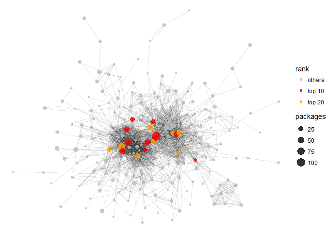<!-- -->

Embora a visualização com todos os nós seja complicada é possível visualizar que alguns dos autores no grupo selecionado realmente atuam como "pontes" (_bridges_) concentrado arestas entre grupos distintos.


#### Comunidades

Uma outra análise que podemos fazer, diz respeito a identificar e avaliar os diversos clusters (_comunidades_) dentro da rede, ou seja, grupos de autores fortemente conectados entre si, e fracamente conectados com outros grupo de autores, podemos identificar agrupando de acordo com a centralidade de *betweenness* das arestas.


```r
h <- h %>%
  activate("nodes") %>%
  mutate(
    clst = as.factor(group_edge_betweenness())
  )

clusters <- h %>%
  activate("nodes") %>%
  as.tibble() %>%
  group_by( clst ) %>%
  summarise( authors = n() ) %>%
  arrange( desc(authors) )

total_clusters <- nrow(clusters)

knitr::kable( head(clusters, 10), caption = "Comunidades de Autores dentro da Rede" )
```


Table: Comunidades de Autores dentro da Rede

clst    authors
-----  --------
3            55
1            54
42           10
23            7
54            7
2             6
30            5
8             4
10            4
12            4


Encontramos 71 comunidades dentro da rede, dos quais duas se destacam pelo número de colaboradores bem acima dos demais. Vamos visualizar algumas comunidades sobre a estrutura da rede.


```r
h <- h %>%
  activate("nodes") %>%
  mutate ( 
    community = as.factor(
      case_when(
        clst == 3 ~ "Comunidade 3",
        clst == 1 ~ "Comunidade 1",
        clst == 42 ~ "Comunidade 42",
        clst == 23 ~ "Comunidade 23",
        TRUE ~ "Others"
      )
    )
  )


ggraph(h, layout="lgl") +
  geom_edge_fan(alpha=0.1)+
  geom_node_point(aes(color=community, size=packages),alpha=0.8) +
  theme_void() +
  scale_color_manual(breaks = c("Comunidade 3","Comunidade 1","Comunidade 42","Comunidade 23" ,"Others"),
                     values=c("red","blue","green","orange","grey"))
```

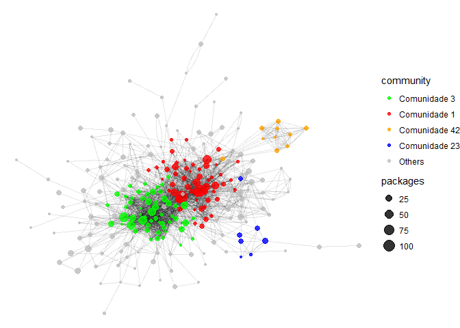<!-- -->


Claramente podemos observar a organização dos clusters dentro da estrutura. Cada um dos clusters poderiam ser separados da estrutura e analisados à parte, aplicando novamente as métricas de centralidade para evidenciar os seus atores principais e sua dinâmica de integração.


## Conclusão

Vimos que as técnicas de análise de rede usando métricas de centralidade são relevante para identificar os principais autores de uma rede, analisar a estrutura e identificar padrões. Particularmente em estruturas muito complexas e com muitos atores, as métricas conseguem expor à luz, padrões e comportamento embutidos na estrutura.

Além disso o carácter _reproduzível da análise_[^5] feita em R permite refinar continuamente a análise, eliminando resíduos e apurando os resultados


## Referências

[^1]: [R](https://www.r-project.org/) é uma linguagem de programação e ambiente para computação e análise estatística, de uso gratuito e que que fornece uma ampla variedade de técnicas  para: modelagem linear e não-linear, testes estatísticos, análise de séries temporais, classificação, agrupamento. 

[^2]: [CRAN](https://cran.r-project.org/) ou _Comprehensive R Archive Network_ é uma rede de FTP e servidores web ao redor do mundo que armazenam versões de código e documentação atualizadas para pacotes e bibliotecas para R. 

[^3]: Matriz de vértices contra vértices cuja as células indica o peso ou a ligação entre os vértices.

[^4]: Escolhido com base no formato dos componentes e escolhendo três casos distintos.

[^5]: _Reproducible Research_ ou **pesquisa reproduzível** é a ideia de que a análise de dados e, em geral, as alegações científicas, são publicados com seus dados e código de software para que outros possam verificar as descobertas e construir sobre elas.

BURT, R. Structural Holes. University of Chicago Press, Chicago, 1992.

BURT, R. S. (. Structural holes versus network closure as social capital. (Cap. 2, pp. 31-56). New York: Aldine de Gruyter. 2001

ENGLE, S. Structural Holes and Simmelian Ties: Exploring Social Capital, Task Interdependence and Individual Effectiveness. Phd Thesis, University of North Texas, 1999.

MARTELETO, R. M. Análise de redes sociais - aplicação nos estudos de transferência da informação. Ciência da Informação, Brasília, v.30, n. 1, p. 71-81, jan./abr. 2001. 

MARTELETO, Regina Maria  and  SILVA, Antonio Braz de Oliveira e. Redes e capital social: o enfoque da informação para o desenvolvimento local. Ci. Inf. 2004, vol.33, n.3, pp.41-49.

NEWMANN, M. Networks. Oxford University Press. April 2010.

STORCH, S.. As redes sociais já fazem parte de nosso jeito de pensar. Disponível em: http://www.intranetportal.com.br/e-gov/redessociais - Acesso em: 15 set. 2008. 

WASSERMAN, S.; FAUST, K. Social network analysis: methods and applications. Cambridge: Cambridge University Press, 1994
